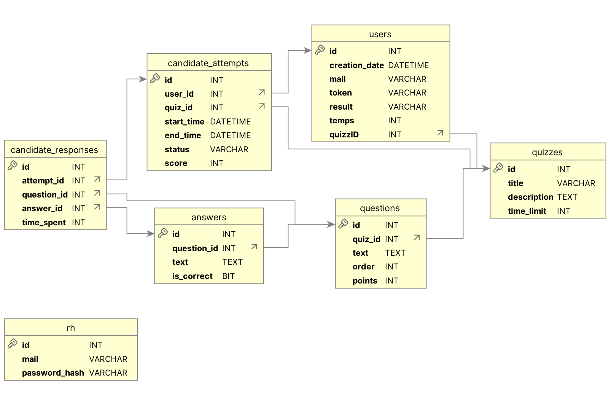

# Service RH - Système de Connexion et Gestion des Quiz

Ce projet est une application web pour le service RH d'une entreprise de cybersécurité. Il permet de :
- Gérer un système de connexion sécurisé pour le personnel RH.
- Permettre aux RH de naviguer vers un quiz.
- Offrir une base pour l'intégration des fonctionnalités comme la gestion des données des candidats et des quiz.

## Table des matières
- [Technologies Utilisées](#technologies-utilisées)
- [Installation](#installation)
- [Structure du Projet](#structure-du-projet)
- [Fonctionnalités](#fonctionnalités)
- [Utilisation](#utilisation)
- [Structure de la Base De Données](#structure-de-la-base-de-données)
- [Améliorations Futures](#améliorations-futures)
- [Contribution](#contribution)
- [Licence](#licence)

## Technologies Utilisées
- **Backend** : [Node.js](https://nodejs.org/) avec [Express.js](https://expressjs.com/)
- **CSS** : Design moderne avec des fichiers de style dédiés
- **Sessions** : Utilisation d'[express-session](https://www.npmjs.com/package/express-session) pour gérer l'état de connexion
- **Stockage de données** : Mariadb

## Installation

### Prérequis
- Node.js (v14 ou supérieur)
- npm (v6 ou supérieur)

### Étapes
1. Clonez ce repository sur votre machine locale :
   ```bash
   git clone https://github.com/votre-nom/service-rh-quiz.git
   cd service-rh-quiz
   ```

2. Installez les dépendances :
   ```bash
   npm install
   ```

3. Lancez l'application :
   ```bash
   npm start
   ```

4. Accédez à l'application via votre navigateur à l'adresse : `http://localhost:3000`

## Structure du Projet
```
.
├── app.js                # Point d'entrée de l'application
├── bin
│   └── www               # Script de démarrage du serveur
├── db.js                 # Configuration de la base de données principale
├── db2.js                # Configuration de la base de données secondaire
├── middleware
│   └── auth.js           # Middleware d'authentification
├── package.json          # Dépendances et scripts
├── package-lock.json     # Verrou des versions des dépendances
├── public
│   └── stylesheets
│       ├── quizze.css    # Styles pour les quiz
│       └── style.css     # Styles généraux
├── README.md             # Documentation
├── routes
│   ├── gentoken.js       # Routes pour la génération de tokens
│   ├── index.js          # Routes principales
│   ├── quiz_create.js    # Routes pour la création de quiz
│   ├── quiz.js           # Routes générales pour les quiz
│   ├── quiz_list.js      # Routes pour lister les quiz
│   ├── quizz.js          # Routes pour répondre au quiz
│   ├── resultatsCandidat.js # Routes pour afficher les résultats des candidats
│   └── users.js          # Routes pour la gestion des utilisateurs
└── views
    ├── c-quizz.html      # Vue pour les quiz candidats
    ├── error.html        # Page d'erreur
    ├── genToken.html     # Page de génération de token
    ├── login.html        # Page de connexion
    ├── quiz_create.html  # Page de création de quiz
    ├── quiz_edit.ejs     # Template EJS pour l'édition de quiz
    ├── quiz.html         # Home Page (Affichage du dernier quiz créé)
    ├── quizz.html        # Page de réponse au quiz
    ├── resultatsCandidat.html # Page des résultats du candidat
    ├── resultats.html    # Page des résultats généraux
    └── stats.html        # Page des statistiques
```

## Fonctionnalités

### Système de Connexion
- Interface de connexion sécurisée
- Gestion des sessions utilisateur
- Protection des routes contre les accès non autorisés

### Gestion des Quiz
- Création de nouveaux quiz
- Édition des quiz existants
- Liste des quiz disponibles
- Système de génération de tokens pour accès candidat

### Gestion des Résultats
- Affichage des résultats par candidat
- Statistiques globales
- Analyse des performances

### API RESTful
- Routes structurées pour l'accès aux différentes fonctionnalités
- Séparation claire entre logique métier et présentation

## Utilisation

### Connexion au Système
1. Accédez à la page d'accueil de l'application
2. Entrez vos identifiants (email/mot de passe)
- Les identifiants des RH sont créés directement dans la base de données, avec un mot de passe hashé à l’aide de bcrypt.
```bash
mail: rh@company.com
mdp: Password123!
```
3. Après authentification, vous serez redirigé vers le tableau de bord

### Gestion des Quiz
1. Créez un nouveau quiz via "/quiz_create"
2. Consultez la liste des quiz existants via "quiz_list.js"
3. Modifiez un quiz existant via "quiz_edit.ejs"

### Génération de Tokens
1. Accédez à "/genToken"
2. Générez un token pour un candidat avec son mail
3. Partagez le lien avec le token au candidat

### Suivi des Résultats
1. Consultez les résultats individuels via "resultatsCandidat.html"
2. Analysez les statistiques globales via "stats.html"

### Structure de la base de données



Le système utilise une base de données MySQL avec la structure suivante :

- **rh** : Stocke les informations d'authentification des utilisateurs RH
- **users** : Contient les données des candidats (email, token, résultats)
- **quizzes** : Définit les quiz disponibles dans le système
- **questions** : Stocke les questions associées à chaque quiz
- **answers** : Contient les réponses possibles pour chaque question
- **candidate_attempts** : Enregistre les tentatives des candidats
- **candidate_responses** : Stocke les réponses données par les candidats

Pour initialiser la base de données, utilisez le script SQL disponible dans `docs/Script_Bdd.sql`.

## Améliorations Futures
- Implémentation d'une authentification plus robuste avec JWT
- Interface utilisateur responsive pour une meilleure expérience mobile
- Export des données au format CSV/Excel
- Système de notifications par email pour les nouvelles tentatives de quiz
- API documentée avec Swagger pour faciliter l'intégration

## Contribution
Les contributions sont les bienvenues ! Pour contribuer :

1. Forkez le projet
2. Créez votre branche de fonctionnalité (`git checkout -b feature/amazing-feature`)
3. Committez vos changements (`git commit -m 'Add some amazing feature'`)
4. Poussez vers la branche (`git push origin feature/amazing-feature`)
5. Ouvrez une Pull Request

## Licence
Ce projet est sous licence [MIT](https://opensource.org/licenses/MIT).